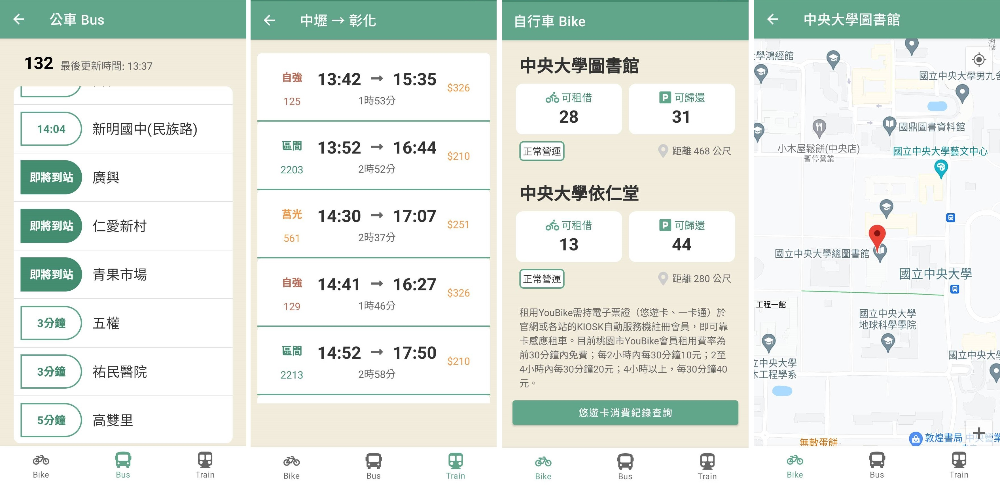

# NCU_bus_tool
給中央大學在校生的交通APP

## 服務內容
- 查詢校內公車即時動態、 Youbike 站點車輛及空位數量，同時提供台鐵時刻表查詢功能
- 使用 Android Studio 開發應用程式，串接交通部 TDX API，取得即時資訊
- 串接 Google Maps API，顯示站點以及裝置位置
## 介面展示

## 資料來源
串接交通部 TDX API，取得交通部 PTX 平臺即時資料

## Contributors
<!-- ALL-CONTRIBUTORS-LIST:START - Do not remove or modify this section -->
<!-- prettier-ignore-start -->
<!-- markdownlint-disable -->
<table>
  <tr>
    <td align="center"><a href="https://github.com/apple310565"> <b>apple310565</b></a> <a href="https://github.com/apple310565/NCU_bus_tool/commits/master?author=apple310565" title="Code">💻</a></td>
    <td align="center"><a href="https://github.com/jerry4911"> <b>
jerry4911</b></a> <a href="https://github.com/apple310565/NCU_bus_tool/commits/master?author=jerry4911" title="Code">💻</a></td>
  </tr>
</table>

<!-- markdownlint-enable -->
<!-- prettier-ignore-end -->
<!-- ALL-CONTRIBUTORS-LIST:END -->
